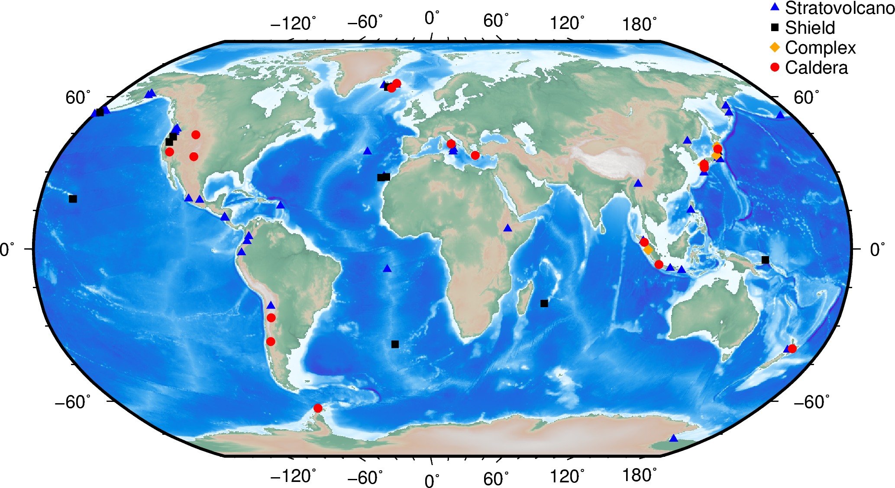
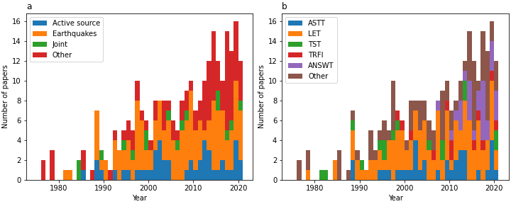

# VolcanoTomo
This repository accompanies the manuscript "Advances in seismic imaging of magma and crystal mush" by Paulatto et al. (in review).
A pre-print of the manuscript is available at EarthArXiv.

The database contains a comprehensive list of seismic studies at arc, hotspot and continental rift volcanoes. From each study we have extracted information on the seismic source, part of the wavefield used in the analysis, the imaging method, any detected low-velocity zones and estimated melt fraction.

## Structure of the repository
- [database](database): contains an Excel spreadsheet with the database,
- [notebooks](notebooks): contains Jupyter notebooks to analyse and plot the database,
- [index.html](index.html): interactive map available [here](https://volcanotomo.github.io/Repository/).

### Map of volcanoes that have been studied with seismic imaging

### Published volcano tomography papers through the years

## Adding more volcanoes or correcting the database
This database is a work in progress and may contain errors. We welcome corrections and new contributions to the database. We have tried to collect as many seismic imaging studies as we could find, but we may have missed a few. If you are the author of a volcano seismic imaging study that is not included in our database and would like it to be added please get in touch. You can request edits through github (pull request) or by sending us an email. If we have included your study but you spot an error, please let us know.

When requesting a new database entry please provide as much information as possible. We only include studies that have been peer-reviewed. 

## Citing
Please cite the following article if using the database:
Paulatto, M., Hooft, E.E.E, Chrapkiewicz, K., Heath, B., Toomey, D.R. and Morgan, J.V. (in review), Advances in seismic imaging of magma and crystal mush.

